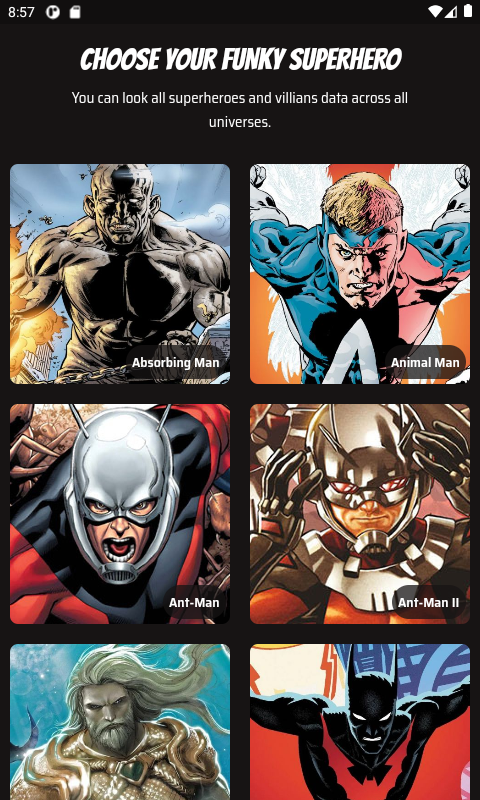
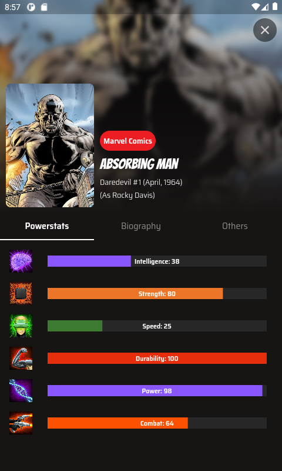

# Heropedia

A mobile application that features a collection of superheroes all across different universes.

This awesome application is powered by [Superhero API](https://superheroapi.com/).

This is the final workshop output for Funky Flutter Festival 2022 hosted by 
[Google Developer Students Club PH](https://www.facebook.com/dsc.philippines).
## Screenshots
<table style="padding:10px">
  <tr>
    <td> 
        
    </td>
    <td>
        
    </td>
  </tr>
</table>

## Getting Started
A few resources to get you started if this is your first Flutter project:

- [Lab: Write your first Flutter app](https://flutter.dev/docs/get-started/codelab)
- [Cookbook: Useful Flutter samples](https://flutter.dev/docs/cookbook)
- [Dartpad: Train your skills in Dart](https://dart.dev/#try-dart)
- [Official Flutter Youtube Channel](https://www.youtube.com/channel/UCwXdFgeE9KYzlDdR7TG9cMw)
- [Dart Documentation](https://dart.dev/guides)

For help getting started with Flutter, view our
[online documentation](https://flutter.dev/docs), which offers tutorials,
samples, guidance on mobile development, and a full API reference.